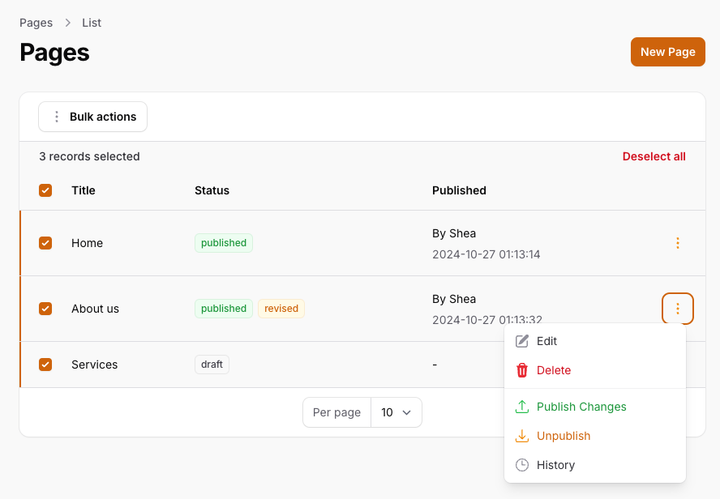
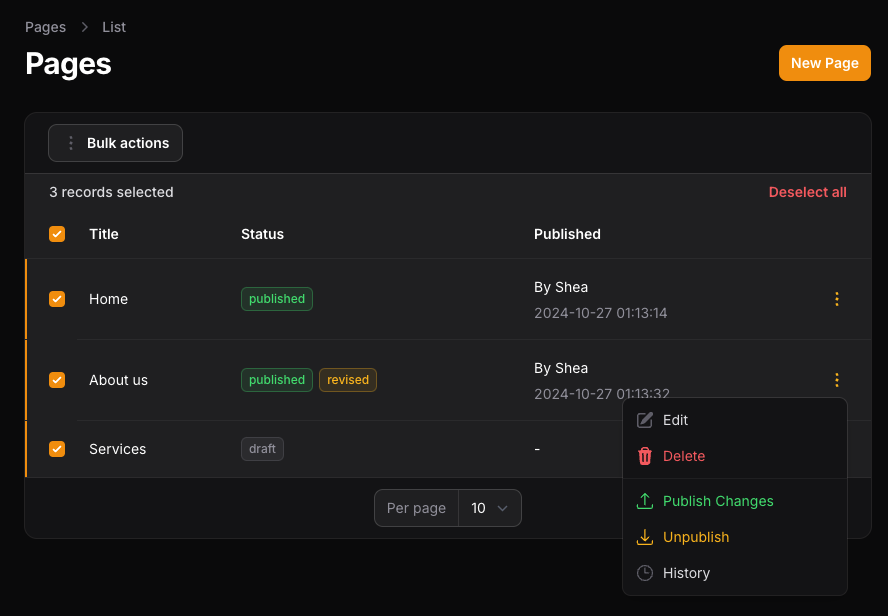
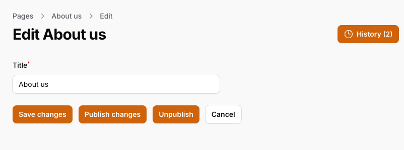
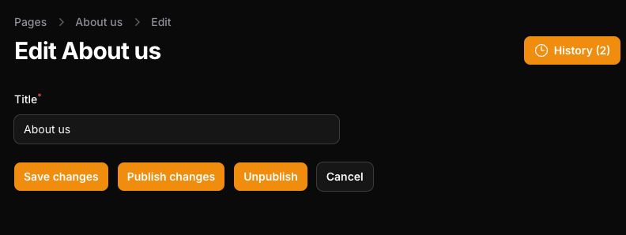
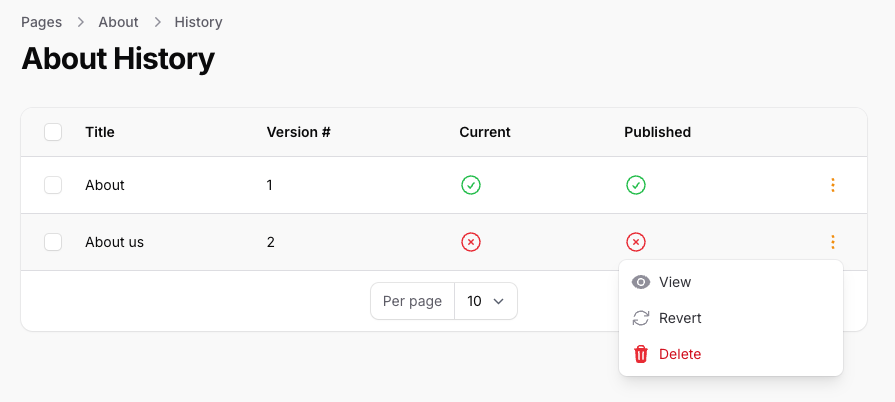
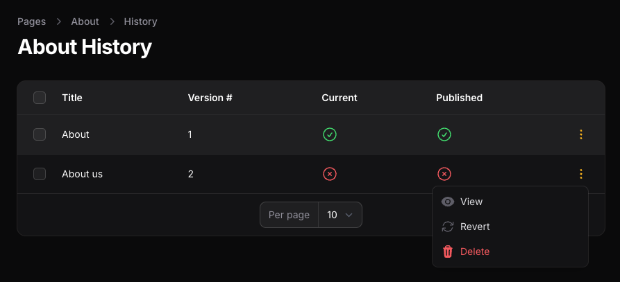

# Revisor + Filament = 🔥

Instantly add robust draft, versioning, and publishing functionality to your FilamentPHP admin panel with the [Revisor Filament plugin](https://github.com/indracollective/laravel-revisor-filament). This plugin offers a collection of Filament Actions, Table Columns, and Page components to seamlessly integrate Revisor with [FilamentPHP](https://filamentphp.com), a popular admin panel for Laravel composed of beautiful full-stack components.

:::info The FilamentPHP plugin currently in development. Check back soon for more information soon.
:::

## Screenshots

{.light-only}
{.dark-only}

☝️ Table Actions / Bulk Actions for publishing and unpublishing records, viewing the revision history in Filament Tables.

...

{.light-only}
{.dark-only}

☝️ Regular Actions for publishing and unpublishing records, viewing the revision history on Filament Edit pages.

{.light-only}
{.dark-only}

☝️ View the version history of a record, and Revert to a previous versions of a record.

## Installation

Follow the [Revisor installation guide](/installation) to get started.

## Examples

### Table Columns

```php
use Filament\Resources\Resource;
use Indra\RevisorFilament\Filament\StatusColumn;
use Indra\RevisorFilament\Filament\PublishInfoColumn;

class PageResource extends Resource
{
    ...

    public static function table(Table $table): Table
    {
        return $table
            ->columns([
                StatusColumn::make('status'),
                PublishInfoColumn::make('publish_info'),
            ])
            ...
```

☝️ Add the
`StatusColumn` to your Resource's Table definition to display the records's published statuses (draft, published, revised).

Add the
`PublishInfoColumn` to your Resource's Table definition to display the records's publish information (published date, publisher).

### Table Actions

```php
use Filament\Resources\Resource;
use Filament\Tables\Actions\ActionGroup;
use Indra\RevisorFilament\Filament\PublishTableAction;
use Indra\RevisorFilament\Filament\UnpublishTableAction;
use Indra\RevisorFilament\Filament\ListVersionsTableAction;

class PageResource extends Resource
{
    ...

    public static function table(Table $table): Table
    {
        return $table
            ->actions([
                ActionGroup::make([
                    PublishTableAction::make(),
                    UnpublishTableAction::make(),
                    ListVersionsTableAction::make(),
                ])
            ])
            ...
    }
```

☝️ Add the
`PublishTableAction` to your Resource's Table definition to display a Publish Action for each record. This action will only display on records that are
**not published**.

Add the
`UnpublishTableAction` to your Resource's Table definition to display an Unpublish Action for each record. This action will only display on records that
**are published**.

Add the
`ListVersionsTableAction` to your Resource's Table definition to allow users to view the version history of a record. Note this this action requires that your Resource has a versions page, see [List Version Records](#list-version-records).

### Table Bulk Actions

```php
use Filament\Resources\Resource;
use Filament\Tables\Actions\BulkActionGroup;
use Indra\RevisorFilament\Filament\PublishBulkAction;
use Indra\RevisorFilament\Filament\UnpublishBulkAction;

class PageResource extends Resource
{
    ...

    public static function table(Table $table): Table
    {
        return $table
            ->bulkActions([
                BulkActionGroup::make([
                    PublishBulkAction::make(),
                    UnpublishBulkAction::make(),
                ])
            ])
            ...
    }
```

☝️ Add the
`PublishBulkAction` and UnpublishBulkAction` to your Resource's Table definition to display Publish/Unpublish Actions for all selected records.

### List Version Records

```php

use App\Filament\Resources\PageResource;
use Indra\RevisorFilament\Filament\ListVersions;

class ListPageVersions extends ListVersions
{
    protected static string $resource = PageResource::class;
}

```

☝️ To display the version history of a record, first create a new Filament Resource Page that extends the
`ListVersions` Page Class. The ListVersions Class defines a simple table with versioning columns and actions for viewing and reverting to a previous version of a record.

```php

use Filament\Resources\Resource;
use App\Filament\Resources\PageResource\Pages\ListPageVersions;

class PageResource extends Resource
{
    ...
    public static function getPages(): array
    {
        return [
            'versions' => ListPageVersions::route('/{record?}/versions'),
        ];
    }
```

☝️ Next, be sure to register your ListVersions Page in your Resource's `getPages()` method.

### View Version Records

```php

use App\Filament\Resources\PageResource;
use Indra\RevisorFilament\Filament\ViewVersion;

class ViewPageVersion extends ViewVersion
{
    protected static string $resource = PageResource::class;
}

```

☝️ To display a full view of a particular version of a record, first create a new Filament Resource Page that extends the
`ViewVersion` Page Class. The ViewVersion Class displays the selected version of your record using your Resource's form of infolist, and provides an action for reverting the record to this version.

```php

use Filament\Resources\Resource;
use App\Filament\Resources\PageResource\Pages\ViewPageVersion;

class PageResource extends Resource
{
    ...
    public static function getPages(): array
    {
        return [
            'view_version' => ViewPageVersion::route('/{record}/versions/{version}'),
        ];
    }
```

☝️ Next, be sure to register your ViewPageVersion Page in your Resource's `getPages()` method.

